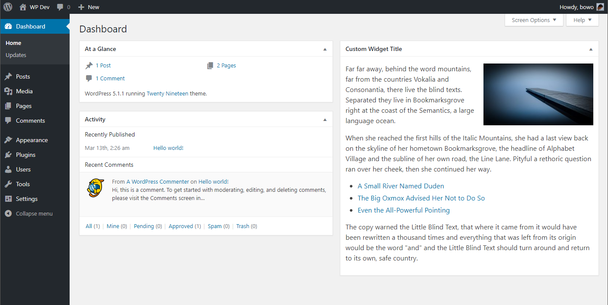
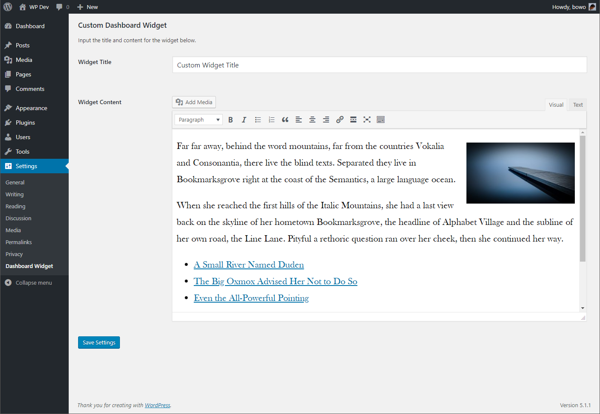

# Description

This is a simple WordPress plugin that displays a dashboard widget with static HTML content. The codebase has been refactored using [WordPress Plugin Boilerplate](https://github.com/DevinVinson/WordPress-Plugin-Boilerplate) since v2.0.

## Screenshots

